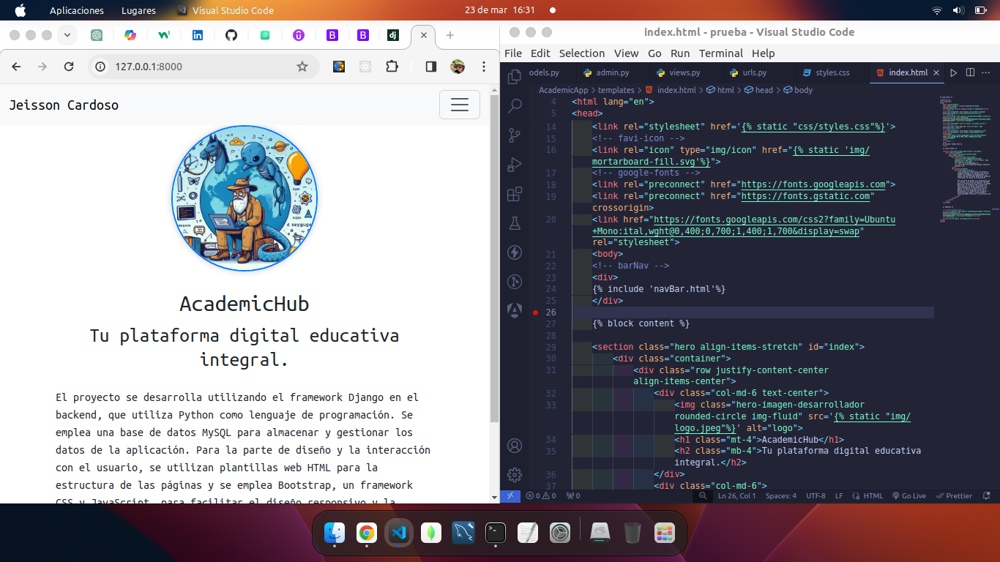

# AcademicHub

¡Bienvenido a AcademicHub, tu plataforma educativa integral! 💡💻

Sumérgete en el mundo del aprendizaje con nuestro proyecto AcademicHub, donde convergen la innovación y la tecnología. 💫

En AcademicHub, combinamos la potencia del framework Django con el poder de Python en el backend para crear una experiencia educativa única. 💡🐍 Utilizamos una base de datos MySQL para almacenar y gestionar los datos de manera eficiente. 🗃️

¡Pero eso no es todo! Para dar vida al diseño y garantizar una experiencia de usuario excepcional, nos apoyamos en #Bootstrap, el aliado perfecto para un diseño responsivo y lleno de estilo. 💻✨ Además, hacemos magia con CSS para personalizar cada elemento de la página, ¡porque la creatividad no tiene límites! 🎨✨

Y no nos olvidemos de JavaScript, el ingrediente secreto que añade interactividad y dinamismo a nuestra plataforma. 🚀💫

¡Únete a nosotros en AcademicHub y comienza tu viaje hacia el conocimiento! 🚀📚 #Educación #Tecnología #Innovación #Aprendizaje



## Características principales
- **Framework Django:** Utilizamos Django en el backend para proporcionar una sólida arquitectura para nuestra plataforma.
- **Python:** El lenguaje de programación Python nos permite desarrollar de manera eficiente y escalable.
- **Base de datos MySQL:** Almacenamos y gestionamos los datos de nuestros usuarios y contenido utilizando MySQL.
- **Bootstrap:** Nos apoyamos en Bootstrap para el diseño responsivo y la interactividad de la interfaz de usuario.
- **CSS y JavaScript:** Utilizamos CSS para estilizar y personalizar los elementos de la página, y JavaScript para añadir interactividad y funcionalidades dinámicas a la aplicación web.

## Instalación

1. Clona este repositorio en tu máquina local.
```bash
git clone https://github.com/Bemontx/AcademicHub.git
```
2. Asegúrate de tener Python y pip instalados.
3. Crea un entorno virtual para el proyecto y actívalo.
```bash
python3 -m venv venv
source venv/bin/activate
```
4. Instala las dependencias del proyecto utilizando `pip install -r requirements.txt`.
5. Ejecuta las migraciones de Django con `python manage.py migrate`.
6. Inicia el servidor local con `python manage.py runserver`.
7. No olvides crear tu super usuario para el control en Admin
```bash
python3 manage.py createsuperuser
```
## Contribución

¡Nos encantaría recibir contribuciones! Si tienes alguna idea de mejora, por favor abre un issue o envía un pull request.

## Contacto

Para cualquier pregunta o consulta, no dudes en ponerte en contacto con nosotros en jeisoncardozo@outlook.com.

¡Gracias por usar AcademicHub!


